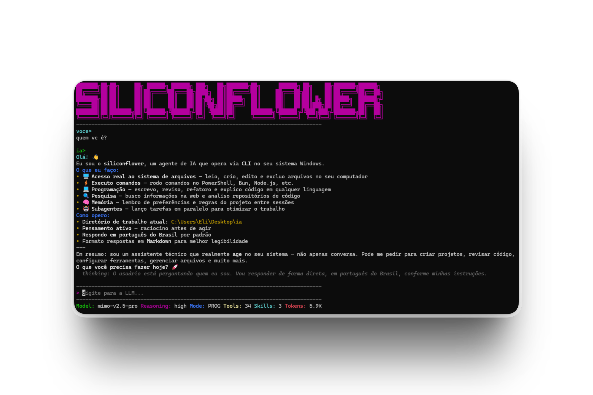

# 🌸 SILICONFLOWER


Agente CLI/TUI de Inteligência Artificial de alta performance para desenvolvimento de software, com suporte nativo a **MCP** (Model Context Protocol), **Subagentes Concorrentes & Background Tasks**, **Memória Persistente**, **Git Worktrees Isolados**, **RepoMap & Busca de Símbolos**, **Artefatos Estruturados**, **Web Search & Fetch**, **Hooks de Automação**, **Raciocínio Controlável (Reasoning)**, **Contador de Tokens em Tempo Real**, **Tratamento de Tarefas (To-Do)**, **Habilidades (.md)** e compatibilidade total com APIs do **SiliconFlow, OpenRouter, OpenAI e Anthropic**.

<p align="center">
  
</p>

> 💡 **Interface Limpa e Leve:** Projetada para Windows Terminal, PowerShell, CMD e VS Code Terminal. Sem necessidade de Nerd Fonts ou caracteres especiais.

---

## 📋 Sumário

- [✨ Funcionalidades](#-funcionalidades)
- [🚀 Instalação e Início Rápido](#-instalação-e-início-rápido)
- [⚙️ Configuração Inicial](#️-configuração-inicial)
- [⚡ Modelos Recomendados (2026)](#-modelos-recomendados-2026)
- [⌨️ Atalhos de Teclado (TUI) & CLI](#️-atalhos-de-teclado-tui--cli)
- [🛠️ Ferramentas Nativas (34 Ferramentas)](#️-ferramentas-nativas-34-ferramentas)
- [🤖 Subagentes & Execução em Segundo Plano](#-subagentes--execução-em-segundo-plano)
- [🧠 Memória Persistente (Projeto e Global)](#-memória-persistente-projeto-e-global)
- [🌳 Git Worktrees Isolados](#-git-worktrees-isolados)
- [🗺️ RepoMap & Busca Semântica de Símbolos](#️-repomap--busca-semântica-de-símbolos)
- [📄 Artefatos Estruturados](#-artefatos-estruturados)
- [🌐 Web Search & Fetching](#-web-search--fetching)
- [⚡ Hooks de Automação](#-hooks-de-automação)
- [🧩 Servidores MCP](#-servidores-mcp)
- [🎭 Modos de Operação & Raciocínio](#-modos-de-operação--raciocínio)
- [🎯 Habilidades (Skills .md)](#-habilidades-skills-md)
- [📦 Compilando Executável Standalone (.exe)](#-compilando-executável-standalone-exe)
- [📁 Estrutura do Projeto](#-estrutura-do-projeto)
- [📜 Licença](#-licença)

---

## ✨ Funcionalidades

| Área | Descrição |
| :--- | :--- |
| **Provedores LLM** | Suporte unificado a APIs OpenAI-compatible (`/v1/chat/completions`) e Anthropic (`/v1/messages`), incluindo streaming e chamadas paralelas de ferramentas. |
| **Subagentes Especializados** | Spawning de subagentes com papéis pré-configurados (`research`, `verification`, `plan`, `coder`, `general`, `custom`), com suporte a execução síncrona ou em segundo plano. |
| **Memória Persistente** | Armazenamento persistente de regras, feedback do usuário e contexto do projeto (`.siliconflower/memory`), com injeção automática e gerenciamento de escopos. |
| **Git Worktrees** | Criação, listagem e descarte de Git Worktrees temporários para desenvolvimento de experimentos e tarefas isoladas sem risco à branch principal. |
| **RepoMap & Símbolos** | Mapeamento inteligente de repositórios (TypeScript, JavaScript, Python, Go, Rust, C++) com extração de assinaturas e busca rápida de símbolos. |
| **Artefatos Estruturados** | Gestão de entregáveis e relatórios em Markdown, HTML, JSON, Mermaid ou Código (`.siliconflower/artifacts`). |
| **Web Search & Fetch** | Busca na Web e extração de páginas convertidas para Markdown limpo diretamente nas ferramentas nativas. |
| **Hooks de Automação** | Execução automática de comandos em pontos-chave do ciclo de vida do agente (`preTool`, `postTool`, `onEdit`, `onCommand`). |
| **Contador de Tokens** | Monitoramento de tokens em tempo real na TUI com estimativa instantânea + metadados oficiais de uso da API. |
| **Raciocínio (Reasoning)** | Níveis `none` / `low` / `medium` / `high`. Envia `reasoning_effort` (OpenAI/DeepSeek) ou `thinking` com `budget_tokens` (Anthropic). Alternável via `Ctrl+E`. |
| **Modos de Operação** | `programação` (código), `sistema` (administração de SO) e `plano` (apenas leitura e planejamento seguro). Alternável via `Ctrl+O`. |
| **Protocolo MCP** | Integração total com servidores MCP via `stdio` (Git, Filesystem, SQLite, Brave Search, etc.). |
| **Executável Único (.exe)** | Compilação nativa para Windows via `bun build --compile`, gerando um binário standalone sem necessidade de Node.js instalado. |

---

## 🚀 Instalação e Início Rápido

### Pré-requisitos

* **Bun >= 1.1** (Recomendado): https://bun.sh
* **ou Node.js >= 20** + `tsx` (pré-configurado nas dependências).

### Clonar e Executar

```powershell
git clone https://github.com/siliconflower/siliconflower.git
cd siliconflower
bun install
bun run start          # Inicia a TUI; na 1ª vez abre o assistente de configuração
```

Outras formas de execução:

```powershell
# Iniciar com parâmetros específicos
bun run start -- -m deepseek-ai/DeepSeek-V4-Pro -r high --mode programacao

# Executar via Node.js
node bin\siliconflower.js

# Compilar e instalar no PATH do Windows (sem necessidade de privilégios de administrador)
bun run build
npm run install:bin
```

---

## ⚙️ Configuração Inicial

Na primeira execução, o assistente interativo (*wizard*) configura:

1. **Variante do Provedor:** `openai` ou `anthropic`.
2. **Base URL:** ex: `https://api.siliconflow.com/v1`, `https://openrouter.ai/api/v1` ou `https://api.anthropic.com`.
3. **Model ID:** ex: `deepseek-ai/DeepSeek-V4-Pro`, `claude-5`, `gpt-5.5`.
4. **Chave de API (API Key):** Entrada mascarada com asteriscos.
5. **Nível Padrão de Raciocínio (Reasoning):** `none`, `low`, `medium` ou `high`.
6. **Prompt de Sistema, Servidores MCP e Hooks (Opcionais).**

As configurações são salvas em `~/.siliconflower/config.json`:

```json
{
  "provider": "openai",
  "baseURL": "https://api.siliconflow.com/v1",
  "apiKey": "sk-...",
  "model": "deepseek-ai/DeepSeek-V4-Pro",
  "reasoning": "high",
  "mode": "programação",
  "hooks": {
    "onEdit": "bun x tsc --noEmit",
    "postTool": "git status"
  },
  "mcpServers": {
    "filesystem": {
      "command": "npx",
      "args": ["-y", "@modelcontextprotocol/server-filesystem", "C:/Users/username"]
    }
  }
}
```

### Comandos de Gerenciamento da Configuração

```powershell
bun run start -- config   # Re-executa o assistente de configuração
bun run start -- show     # Exibe as configurações atuais (chave mascarada)
bun run start -- ensure   # Cria o arquivo de configuração caso não exista e sai
```

### Variáveis de Ambiente (Fallback)

* `SILICONFLOWER_API_KEY` - Chave de API.
* `SILICONFLOWER_BASE_URL` - URL base da API.
* `SILICONFLOWER_MODEL` - Modelo padrão.

---

## ⚡ Modelos Recomendados (2026)

### Pesos Abertos (Open-Weights) & Provedores Compatíveis (SiliconFlow, OpenRouter, etc.)

| Modelo | Parâmetros / Ativos | Janela de Contexto | Suporte a Tools | Raciocínio (Reasoning) | Foco Principal |
| :--- | :---: | :---: | :---: | :---: | :--- |
| `deepseek-ai/DeepSeek-V4-Pro` | **284B–1.6T** (MoE) | 1M tokens | ✅ Sim | ✅ Nativo | Programação avançada, raciocínio lógico e baixo custo |
| `Qwen/Qwen-3.7-Max` | Até **1.1T** (MoE) | 1M tokens | ✅ Sim | ✅ Nativo | Código de alto nível, matemática e multilíngue |
| `meta-llama/Llama-4-Scout` | Dezenas a 100s B | **Até 10M tokens** | ✅ Sim | ❌ Não | Processamento de contextos massivos e privacidade |
| `z-ai/GLM-5.2` | **753B** (40B ativos) | 1M tokens | ✅ Sim | ✅ Nativo | Automação de tarefas, uso de terminal e agentes |
| `moonshot/Kimi-K3` | **~1T** (MoE) | 1M+ tokens | ✅ Sim | ✅ Nativo | Raciocínio avançado em código e matemática |
| `google/Gemma-4-31B` | **31B** | 256k tokens | ✅ Sim | ❌ Não | Execução local eficiente e SLM de alta inteligência |

### Modelos Proprietários (Código Fechado)

| Modelo | Desenvolvedor | Janela de Contexto | Suporte a Tools | Raciocínio | Foco Principal |
| :--- | :--- | :---: | :---: | :---: | :--- |
| `gpt-5.5` / `gpt-5.6` | OpenAI | 400k – 1M tokens | ✅ Sim | ✅ Nativo | Raciocínio avançado, fluxos autônomos e agentes |
| `claude-opus-4.8` / `claude-5` | Anthropic | 1M+ tokens | ✅ Sim | ✅ Nativo | Engenharia de software profunda e revisão de código |
| `gemini-3.5-pro` | Google | 1M – 2M tokens | ✅ Sim | ✅ Nativo | Multimodalidade nativa e contexto ultra longo |
| `grok-4.3` | xAI | 1M tokens | ✅ Sim | ✅ Nativo | Pesquisa em tempo real e raciocínio técnico |

---

## ⌨️ Atalhos de Teclado (TUI) & CLI

### Atalhos na Interface (TUI)

| Atalho | Ação |
| :--- | :--- |
| `Enter` | Envia a mensagem digitada |
| `Ctrl+E` | Alterna o nível de raciocínio (`none` ➔ `low` ➔ `medium` ➔ `high`) |
| `Ctrl+O` | Alterna o modo de operação (`programação` ➔ `sistema` ➔ `plano`) |
| `Ctrl+C` | Cancela a geração em andamento; pressione 2x para sair |

### Parâmetros de Linha de Comando (CLI)

```powershell
  -m, --model <id>        Sobrescreve o modelo selecionado
  -r, --reasoning <level> Define o nível: none | low | medium | high
      --mode <mode>       Define o modo: programacao | sistema | plano
      --provider <type>   Define o provedor: openai | anthropic
      --base-url <url>    Sobrescreve a URL base da API
      --api-key <key>     Sobrescreve a chave de API
```

---

## 🛠️ Ferramentas Nativas (34 Ferramentas)

O Siliconflower disponibiliza um conjunto completo de 34 ferramentas integradas:

| Categoria | Ferramenta | Descrição |
| :--- | :--- | :--- |
| **Arquivos & Edição** | `read_file` | Lê arquivos de texto com suporte a paginação `offset` e `limit` (linhas numeradas). |
| | `write_file` | Cria ou sobrescreve arquivos, criando automaticamente os diretórios pai. |
| | `edit_file` | Substituição inteligente de trechos (`oldText` ➔ `newText`) com matching exato, quebras de linha e fuzzy. |
| | `apply_patch` | Aplicação atômica de patches com múltiplos blocos de substituição. |
| | `list_directory` | Lista arquivos e subpastas de um diretório com metadados básicos. |
| | `create_directory` | Cria diretórios e caminhos aninhados recursivamente. |
| | `move_path` | Move ou renomeia arquivos e pastas com segurança. |
| | `delete_path` | Exclui arquivos ou diretórios com confirmação explícita obrigatória (`confirm: true`). |
| | `file_info` | Consulta tamanho, tipo e carimbos de data/hora de arquivos e pastas. |
| **Busca & Navegação** | `search_files` | Busca rápida de arquivos via padrões glob (`**/*.ts`, `src/**/*.{js,tsx}`). |
| | `grep_content` | Busca textual e regex recursiva em conteúdos de arquivos com número de linha. |
| | `repo_map` | Gera visualização estruturada de arquitetura do repositório com assinaturas de classes e funções. |
| | `find_symbol` | Localiza definições e assinaturas de símbolos específicos pelo repositório. |
| **Execução & Sistema** | `execute_command` | Executa comandos de terminal de forma segura e transparente no PowerShell. |
| | `read_logs` | Consulta e filtra logs de execução do Siliconflower por nível (`info`, `warn`, `error`) e termo. |
| | `ask_question` | Apresenta perguntas interativas de múltipla escolha ou confirmação ao usuário. |
| | `todowrite` | Gerencia o checklist interativo de tarefas exibido na interface TUI (`[✓]`, `[▶]`, `[ ]`). |
| | `read_skill` | Carrega e injeta o conteúdo de habilidades personalizadas salvas em `~/.siliconflower/skills/`. |
| **Subagentes & Tarefas** | `run_task` | Instancia subagente autônomo com papéis dedicados (`research`, `verification`, `plan`, `coder`, `general`). |
| | `send_subagent_message` | Envia mensagens de continuação e instruções adicionais a uma sessão ativa de subagente. |
| | `manage_background_task` | Consulta status, obtém saída acumulada ou interrompe tarefas e subagentes em segundo plano. |
| **Memória Persistente** | `save_memory` | Armazena regra, aprendizado ou diretriz persistente em escopo de `project` ou `global`. |
| | `recall_memory` | Consulta e busca memórias persistentes salvas por palavra-chave. |
| | `forget_memory` | Remove memórias desatualizadas ou obsoletas pelo nome. |
| **Git Worktrees** | `enter_worktree` | Cria e navega para um Git Worktree temporário em branch isolada para experimentos seguros. |
| | `exit_worktree` | Remove um Git Worktree após a conclusão dos testes ou mesclagem. |
| | `list_worktrees` | Lista todos os Git Worktrees ativos no repositório. |
| **Artefatos Estruturados** | `create_artifact` | Gera e salva documentos estruturados (`markdown`, `code`, `mermaid`, `html`, `json`). |
| | `read_artifact` | Recupera e exibe o conteúdo de um artefato salvo pelo ID. |
| | `list_artifacts` | Lista todos os artefatos disponíveis do projeto ou globais com metadados. |
| | `delete_artifact` | Exclui um artefato salvo pelo ID. |
| **Web & Redes** | `web_fetch` | Baixa o conteúdo de uma página web e o converte para Markdown limpo e legível. |
| | `web_search` | Realiza buscas na web com extração de resumos e links relevantes. |
| **Hooks & Automação** | `manage_hooks` | Consulta ou atualiza dinamicamente os ganchos de execução configurados (`preTool`, `postTool`, `onEdit`, `onCommand`). |

---

## 🤖 Subagentes & Execução em Segundo Plano

O Siliconflower permite criar subagentes especializados que executam tarefas de forma autônoma sem poluir o contexto da conversa principal:

* **Papéis Especializados (`role`):**
  * `research`: Exploração rápida de código e levantamento de referências de arquitetura.
  * `verification`: Execução de testes, checagens de tipos (`tsc`) e validação de regressões com veredito (PASS/FAIL).
  * `plan`: Arquitetura de soluções e elaboração de planos passo a passo.
  * `coder`: Implementação de código e refatorações específicas.
  * `general`: Execução de tarefas gerais autônomas.
  * `custom`: Subagente guiado por um prompt de sistema personalizado via `customPrompt`.

* **Execução em Segundo Plano (`runInBackground: true`):**
  * Permite que o subagente trabalhe em background enquanto você continua conversando com a LLM.
  * Utilize `manage_background_task` para acompanhar o progresso e `send_subagent_message` para iterar.

---

## 🧠 Memória Persistente (Projeto e Global)

O sistema de memória persistente armazena diretrizes, regras arquiteturais e preferências entre diferentes sessões:

* **Escopo de Projeto:** Armazenado em `<workspace>/.siliconflower/memory/` (aplicável ao repositório).
* **Escopo Global:** Armazenado em `~/.siliconflower/memory/` (aplicável a todas as suas sessões).
* **Injeção Automática:** Todas as memórias salvas são automaticamente incorporadas no System Prompt da LLM no início de cada execução.

---

## 🌳 Git Worktrees Isolados

Trabalhe em refatorações críticas ou testes sem risco de quebrar a branch de trabalho atual:

* `enter_worktree`: Cria um diretório isolado conectado ao Git em uma branch nova (ex: `feature/nova-api`).
* `exit_worktree`: Remove o diretório do worktree com segurança e preserva o histórico Git.
* `list_worktrees`: Exibe o estado e os caminhos de todos os worktrees vinculados ao repositório.

---

## 🗺️ RepoMap & Busca Semântica de Símbolos

Com o `repo_map` e `find_symbol`, o Siliconflower analisa o repositório inteiro e extrai a estrutura de código:

* Suporte nativo a **TypeScript, JavaScript, Python, Go, Rust, C e C++**.
* Mapeamento de assinaturas de funções (`export function ...`), classes, interfaces e tipos.
* Permite à IA entender instantaneamente a arquitetura de projetos grandes com consumo mínimo de tokens.

---

## 📄 Artefatos Estruturados

Salve documentos e especificações importantes em `.siliconflower/artifacts/`:

* **Tipos suportados:** `markdown`, `mermaid` (diagramas), `html`, `json` e `code`.
* Metadados organizados em cabeçalhos frontmatter (`title`, `summary`, `type`, `updatedAt`).
* Ideal para gerar documentações técnicas, diagramas de fluxo, relatórios de auditoria e esquemas de dados.

---

## 🌐 Web Search & Fetching

Consulte informações externas e documentações online diretamente pelo terminal:

* `web_fetch`: Realiza requisições HTTP seguras, remove scripts/estilos indesejados e converte o HTML diretamente para Markdown formatado.
* `web_search`: Realiza buscas estruturadas na web com extração de snippets e URLs de referência.

---

## ⚡ Hooks de Automação

Configure scripts automáticos para serem disparados em momentos-chave:

```json
{
  "hooks": {
    "preTool": "echo Iniciando ferramenta...",
    "postTool": "git status --short",
    "onEdit": "bun x tsc --noEmit",
    "onCommand": "echo Comando executado"
  }
}
```

Os hooks recebem variáveis de ambiente de contexto (`SILICONFLOWER_TOOL_NAME`, `SILICONFLOWER_TOOL_ARGS`, `SILICONFLOWER_FILE_PATH`).

---

## 🧩 Servidores MCP

Adicione qualquer servidor compatível com Model Context Protocol no seu `~/.siliconflower/config.json`:

```json
"mcpServers": {
  "git": { 
    "command": "uvx", 
    "args": ["mcp-server-git", "--repository", "C:/meu-repositorio"] 
  },
  "filesystem": { 
    "command": "npx", 
    "args": ["-y", "@modelcontextprotocol/server-filesystem", "C:/Users/username"] 
  },
  "brave-search": { 
    "command": "npx", 
    "args": ["-y", "@modelcontextprotocol/server-brave-search"],
    "env": { "BRAVE_API_KEY": "sua-chave-aqui" }
  }
}
```

---

## 🎭 Modos de Operação & Raciocínio

| Modo | Foco | Segurança |
| :--- | :--- | :--- |
| `programação` | Leitura, escrita, revisão e refatoração de código com ferramentas completas. | Padrão |
| `sistema` | Administração de sistemas operacionais: scripts PowerShell/Batch, rede e processos no Windows. | Alertas prévios |
| `plano` | **Apenas Leitura / Planejamento.** Ferramentas modificadoras (`write_file`, `edit_file`, `execute_command`, `delete_path`) são estritamente bloqueadas. | Máxima proteção |

---

## 🎯 Habilidades (Skills .md)

Adicione arquivos Markdown em `~/.siliconflower/skills/`. Cada arquivo `.md` é descoberto automaticamente e lido sob demanda pela IA via `read_skill`.

```powershell
bun run start -- skills   # Lista as habilidades descobertas
bun run start -- sync     # Sincroniza habilidades padrão incluídas no pacote
```

---

## 📦 Compilando Executável Standalone (.exe)

Você pode gerar um arquivo `.exe` 100% independente para Windows:

```powershell
bun run build
```

O binário será gerado em `dist/siliconflower.exe`. Para instalá-lo no `%PATH%` de usuário do Windows:

```powershell
npm run install:bin
```

Para validar a instalação:

```powershell
siliconflower --version
```

---

## 📁 Estrutura do Projeto

```text
siliconflower/
├── assets/
│   └── preview.png              # Imagem de demonstração da interface TUI
├── bin/
│   └── siliconflower.js         # Inicializador híbrido (Bun -> tsx -> npx tsx)
├── src/
│   ├── core/
│   │   └── hooks.ts             # Sistema de hooks de ciclo de vida (preTool, postTool, onEdit, onCommand)
│   ├── services/
│   │   ├── artifact.ts          # Gerenciamento de artefatos estruturados (.html, .json, .md, .txt)
│   │   ├── background-tasks.ts  # Registro e acompanhamento de tarefas em segundo plano
│   │   ├── memory.ts            # Memória persistente do usuário e projeto (.siliconflower/memory)
│   │   ├── repomap.ts           # Motor de RepoMap e busca semântica de símbolos em código
│   │   ├── smart-edit.ts        # Edição inteligente de arquivos (exact, newline, fuzzy whitespace)
│   │   ├── subagent.ts          # Orquestrador de subagentes especializados com múltiplos papéis
│   │   ├── web.ts               # Ferramentas nativas de busca web e fetch com conversão Markdown
│   │   └── worktree.ts          # Gerenciamento e isolamento com Git Worktrees
│   ├── App.tsx                  # Componente TUI principal da aplicação (Ink/React)
│   ├── MarkdownText.tsx         # Renderizador de Markdown adaptado para terminal
│   ├── ascii.ts                 # Arte ASCII e logotipo do Siliconflower
│   ├── config.ts                # Gerenciador de configurações e variáveis de ambiente
│   ├── context.ts               # Estimativa de tokens, compressão de histórico e gestão de outputs
│   ├── fs-util.ts               # Utilitários de sistema de arquivos e proteção de caminhos
│   ├── glob-util.ts             # Motor nativo de busca glob de arquivos
│   ├── grep.ts                  # Mecanismo de busca textual e regex recursiva
│   ├── index.tsx                # Ponto de entrada CLI (Commander)
│   ├── llm.ts                   # Adaptador de streaming OpenAI e Anthropic com raciocínio e ferramentas
│   ├── logger.ts                # Sistema de logs com rotação e busca (200 KB)
│   ├── mcp.ts                   # Cliente gerenciador de servidores MCP via stdio
│   ├── modes.ts                 # Definições de personas (programação, sistema, plano)
│   ├── skills.ts                # Gerenciador e sincronizador de habilidades (.md)
│   ├── task.ts                  # Adaptador unificado de subagentes autônomos
│   ├── todo.ts                  # Gerenciador do painel interativo de tarefas (To-Do)
│   ├── tools.ts                 # Definição e registro central das 34 ferramentas nativas
│   ├── types.ts                 # Tipos e interfaces TypeScript compartilhadas
│   └── wizard.ts                # Assistente interativo de configuração inicial
├── tests/                       # Suíte completa de testes unitários (bun test)
├── scripts/
│   └── install.ps1              # Script de instalação do .exe no PATH do Windows
├── build.ts                     # Pipeline de compilação standalone via Bun
├── LLMS.md                      # Guia de arquitetura e contexto para agentes de IA
├── CHANGELOG.md                 # Histórico completo de versões e mudanças
├── package.json
├── tsconfig.json
├── LICENSE
└── README.md
```

---

## 📜 Licença

Distribuído sob a licença **MIT**. Veja `LICENSE` para mais detalhes.
